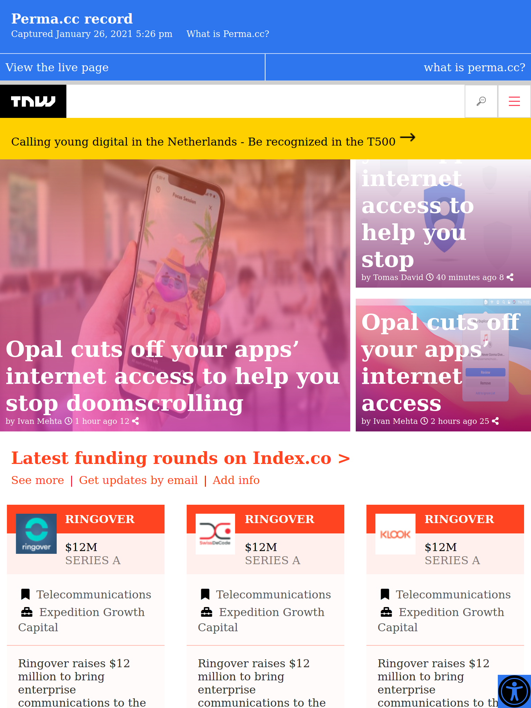

# Perma

> This website is a replica of the next web website it build entirely with HTML and CSS 

## Built With

- HTML
- CSS

## Live Demo

[Live Demo Link](https://shaher-11.github.io/perma/)

## Getting Started

**Clone the Repo or download the zip folder**

**Unzip the folder**

**Open the html file with your browser**

**The project is completely responsive**

## Authors

👤 **Author1**

- GitHub: [@githubhandle](https://github.com/Shaher-11/)
- Twitter: [@twitterhandle](https://twitter.com/ShaherShamroukh/)
- LinkedIn: [LinkedIn](www.linkedin.com/in/Shaher-Shamroukh/)

👤 **Author2**

- GitHub: [@iliebabcenco](https://github.com/iliebabcenco)

## 🤝 Contributing

Contributions, issues, and feature requests are welcome!

Feel free to check the [issues page](issues/).

## Show your support

Give a ⭐️ if you like this project!

## Acknowledgments

- The next web
- Microverse

## 📝 License

This project is [MIT](lic.url) licensed.
